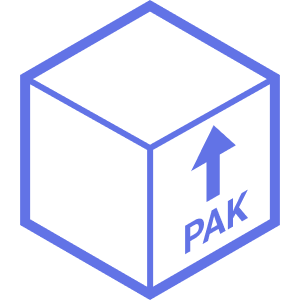

**This crate is still in very early development and is not ready for production use.**

Pak is a simple read-only database file that is meant for persistence of rust types and distribution. It is designed to be fast and easy to use.

# Why Pak?

Pak was made for a very specific use case. It needed to store a lot of data, be fast, and easy to use in an enviornment where the data is immutable.

You should use Pak if you:
- Want to easily persist rust types and share them between programs and/or runs.
- Need to store alot of data and that can be efficiently accessed and shared.
- Don't care about runtime mutability.

You shouldn't use Pak if you:
- Need to modify data during runtime.
- Require complex queries with the SQL language. (Pak does not support SQL queries right now, it may in the future.)

# How to use Pak

There are 3 steps to using Pak. First you must make data to store, then you build the Pak, then you must query the data.

## Making Data Pakable

To make data Pakable, you simply must implement the [PakItemSerialize](crate::PakItemSerialize) and [PakItemDeserialize](crate::PakItemDeserialize) traits.

```rust
pub struct Person {
    name: String,
    age: u32,
}

impl PakItemSerialize for Person {
    fn into_bytes(&self) -> PakResult<Vec<u8>> {
        //...
    }
}

impl PakItemDeserialize for Person {
    fn from_bytes(bytes: &[u8]) -> PakResult<Self> {
        //...
    }
}
```

This will allow your types to be serialized and deserialized by Pak. Types that implement Serde's [Serialize](serde::Serialize) and [Deserialize](serde::Deserialize) traits will automatically implment these traits.

You also may want to implement the [PakItemSearchable](crate::PakItemSearchable) trait to allow your types to be searched by Pak.

```rust
impl PakItemSearchable for Person {
    fn get_indices(&self) -> PakResult<Vec<PakIndex>> {
        vec![PakIndex::new("name", self.name.clone())]
    }
}
```

This will allow any Person type to be searched by Pak, given a name. You can return as many indices as you want, but remember that this will add size to the Pak file. If you are trying to optimize for space, you may want to consider only indexing the values that you want to search with Pak.

## Building a Pak file.

Once you have all of the data that you want to store in a Pak file, you can build it using the [PakBuilder](crate::PakBuilder) struct as so:
```rust
use pak::PakBuilder;

let person = Person { name: "John Doe".to_string(), age: 30 };

let mut paker = PakBuilder::new();

//This will add the object to the Pak file with it's searchable indices and return the pointer to the object.
let pointer = paker.pak(person);

//This will add the object to the Pak file without searchable indices and return the pointer to the object.
let pointer = paker.pak_no_search(person);

// This will build the Pak file and return the Pak object.
let pak = paker.build_file("output.pak");

// This will build the Pak file in memory and return the Pak object.
let pak = paker.build_memory(); 
```

Note that whenever you pak an object, the pointer to that object is returned. This is the primary way to access a non searchable object in the Pak file. You can save these pointers on any object in the pak, as they implement the [PakItemSerialize](crate::PakItemSerialize) and [PakItemDeserialize](crate::PakItemDeserialize) traits.

## Consuming a Pak File

After you have built the pak file, you can open it by calling the following:

```rust
let pak = Pak::new_from_file("output.pak");
```
This creates and instance of the [Pak](crate::Pak) struct that you can read from. The primary way to do that is to use the [query](crate::Pak::query) function.
```rust
use pak::index::{PakIndex, PakIndexIdentifier}

//This is a simple query that will look in the pak for a "Person" object with a name value of "John".
let query = "name".equals("John");

//This will query for all structs of type person with a name value of "John"
let result = pak.query::<(Person,)>(query);
```

For more information on queries, see the [query](crate::query) documentation.
